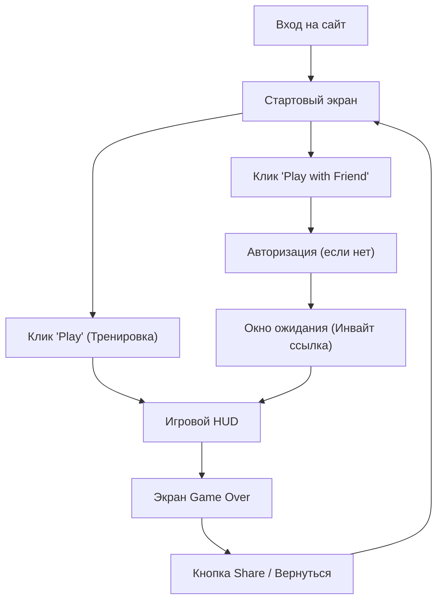

## 1. Обзор продукта
Браузерная 2D-игра в жанре "Артиллерия" (в духе оригинальных Worms). Цель текущего обновления — полностью переработать интерфейс (UI/UX) с нуля, сделав его современным, вирусным, интуитивно понятным на мобильных устройствах и визуально привлекательным.
- Использование оригинальных картинок из классических Worms.
- Создание комедийной, легкой атмосферы с акцентом на абсурд.

## 2. Ключевые функции и Модули

### 2.1 Игровые экраны
1. **Стартовый экран (Меню)**: Огромная кнопка "Play", быстрый доступ к тренировке и мультиплееру. Никаких преград перед первой игрой.
2. **Игровой HUD (Во время матча)**:
   - **Верх**: Статусы команд, здоровье, таймер хода, ветер.
   - **Низ**: Панель выбора оружия (Scrollable карусель на мобильных), подсказки по управлению.
   - **Центр**: Полупрозрачные уведомления о смене хода или победе.
3. **Экран завершения (Game Over / Highlights)**: Показ победителя, статистика, кнопки "Поделиться" и "Вернуться в меню".
4. **Модальные окна**: Авторизация/Профиль, Инвайт-ссылка для мультиплеера.

### 2.2 Детали страниц
| Название экрана | Название модуля | Описание функции |
|-----------|-------------|---------------------|
| Меню | Кнопка старта | "Играть в один клик" |
| Меню | Настройки/Профиль | Скрытое подменю для логина и смены имени |
| HUD | Панель команд | Отображение HP червяков в виде аккуратных баров |
| HUD | Выбор оружия | Лента иконок оригинального оружия Worms |
| HUD | Мобильные контролы | Крупные (от 48px) прозрачные тач-зоны для свайпов, прыжка и стрельбы |

## 3. Основной процесс
Вход в игру -> Одиночный клик по кнопке "Play" -> Запуск тренировочного матча с интерактивными подсказками -> Завершение матча -> Предложение сохранить Replay/Поделиться -> Возврат в меню для игры по сети.

## 4. Дизайн Пользовательского Интерфейса (UI)

### 4.1 Стиль дизайна
- **Тон**: Классические Worms, но с современной "чистой" подачей. Мультяшно, но без визуального мусора.
- **Цвета**: Яркие акценты на UI-элементах (здоровье, таймер, активное оружие) на фоне приглушенного ландшафта.
- **Кнопки**: Слегка "пухлые" (squishy), с эффектом нажатия и приятным hover-стейтом (подпрыгивание, масштаб).
- **Шрифты**: Читаемые, слегка комичные или пиксельные заголовки (в духе ретро, но гладкие по краям), и строгий гротеск для мелкого текста (WCAG контраст).
- **Анимации**: Juice-эффекты. UI должен реагировать на все действия игрока.

### 4.2 Обзор дизайна экранов
| Название экрана | Модуль | Элементы UI |
|-----------|-------------|-------------|
| Меню | Главная кнопка | Огромная, пульсирующая кнопка Play, оригинальный логотип Worms по центру |
| HUD | Оружие | Горизонтальный список снизу с иконками Базуки, Гранаты, Дробовика и т.д. |
| HUD | Индикаторы | Полупрозрачные подложки, яркие шкалы HP (зеленые/красные) |

### 4.3 Адаптивность (Mobile First)
- **Мобилки**: Верхний HUD ужимается. Оружие снизу можно свайпать влево-вправо. Кнопки действий (Прыжок, Огонь) разнесены по краям экрана, чтобы удобно нажимать большими пальцами.
- **Десктоп**: Подсказки для горячих клавиш (Space, Enter, Shift).
- Отсутствие системного зума (pinch-to-zoom заблокирован для UI, зум работает только внутри игрового Canvas).