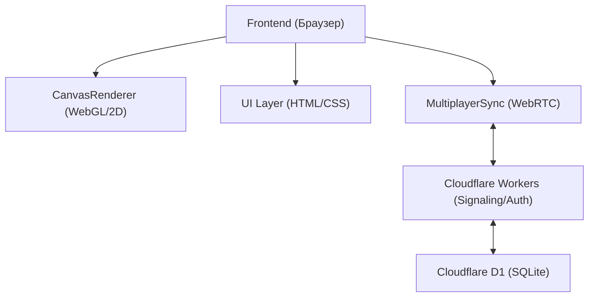
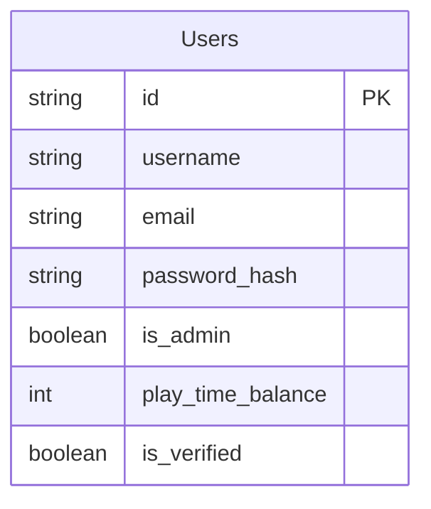

## 1. Архитектура Проекта

## 2. Описание Технологий
- **Frontend**: Vanilla TypeScript + HTML/CSS (полная переработка UI, удаление старого, создание нового).
- **Сборщик**: Vite.
- **Отрисовка**: HTML5 Canvas (2D API, возможный переход на WebGL для сложного зума/эффектов).
- **Сервер**: Cloudflare Workers, D1.

## 3. Определения Маршрутов
| Путь | Назначение |
|-------|---------|
| `/` | Главная страница игры (Меню, HUD, Game Over модалки - Single Page App) |
| `/?room=id` | Переход по инвайт-ссылке для мультиплеера |
| `/admin` | Админ-панель (отдельная HTML страница) |

## 4. API (Взаимодействие с бекендом)
- `POST /api/auth/register`
- `POST /api/auth/login`
- `GET /api/auth/verify`
- `PUT /api/auth/profile`
- WebSocket/Signaling (через KV или Durable Objects Cloudflare для обмена SDP WebRTC).

## 5. Модель Данных (D1)
### 5.1 ER Диаграмма

### 5.2 Архитектурные требования к UI-рефакторингу
- Полное удаление `src/style.css` и `index.html` и написание их с нуля.
- Разделение UI-слоев (Меню, HUD, Логин, Game Over) на четкие изолированные `div` контейнеры с `z-index`.
- Использование CSS Variables для темы.
- Создание адаптивных тач-контролов через `touch-action: none` и обработку `touchstart/touchend` в `main.ts`.
- Анимации UI через CSS `@keyframes` и `transition`.