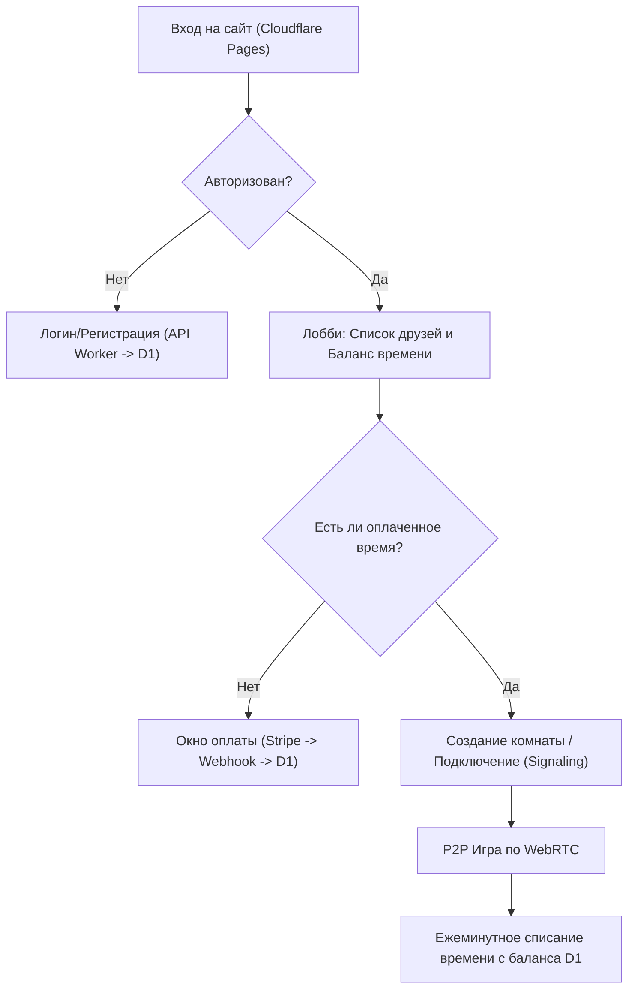

## 1. Обзор продукта
Браузерная 2D-игра (Worms-подобная) с реалистичной аркадной физикой, мультиплеером (WebRTC) и экономикой. Игра полностью работает на бесплатном стеке Cloudflare (Pages, Workers, D1).

## 2. Ключевые функции и Физика

### 2.1 Игровая физика (Worms-style)
- **Запрет ходьбы по стенам**: Червяк не может забираться на вертикальные или слишком крутые склоны (более 50-60 градусов). В таком случае он начинает скользить вниз под действием гравитации. Единственный способ преодолеть препятствие — прыжок.
- **Управление в полете**: Во время прыжка (в воздухе) игрок сохраняет частичный контроль над горизонтальной скоростью (`vx`), что позволяет маневрировать в полете.
- **Урон от падения**: Физический движок отслеживает максимальную вертикальную скорость (`vy`). Если при приземлении скорость превышает безопасный порог, червяк получает урон, пропорциональный силе удара о землю.

### 2.2 Режимы сражений и Матчмейкинг
Игра поддерживает классические опции оригинальных Worms:
- **Лимит времени на ход**: (например, 15, 30 или 45 секунд). По истечении времени ход автоматически передается следующему игроку.
- **Лимиты оружия**: Ограниченное количество ракет, гранат и других спецсредств (будет храниться в JSON-конфигурации матча).
- **Синхронизация разрушений**: Кратеры и изменения ландшафта передаются по сети (P2P) всем клиентам в виде координат взрыва, чтобы избежать пересылки всего массива карты.

### 2.3 Мультиплеер и Друзья
- Простая система авторизации (Логин/Пароль или JWT токены) через Cloudflare API.
- Система друзей: возможность отправить заявку в друзья и видеть их статус (Онлайн/В игре).
- Создание приватных комнат для игры с друзьями.

### 2.4 Монетизация (1$ = 1 час)
- Встроенная биллинговая система. Баланс игрока хранится в базе данных Cloudflare D1 в секундах (PlayTime).
- Прием платежей (например, через Stripe Webhooks или Telegram Stars).

## 3. Основной процесс (Схема игры)

## 4. Дизайн пользовательского интерфейса
### 4.1 Стиль дизайна
- Мультяшный ретро-стиль с плавными анимациями 60 FPS.
- Кнопки: Полупрозрачные экранные стики (D-pad) для мобильных устройств.
- Эффекты: Ретро-ракеты, вспышки взрывов, 8-битный звук.

### 4.2 Адаптивность
- Игровой Canvas сохраняет пропорции 800x600.
- Масштабируется (`resize`) под экраны любых телефонов (портретная/ландшафтная ориентация).