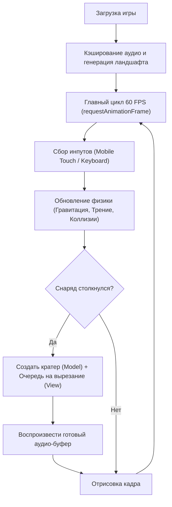

## 1. Обзор продукта
Браузерная 2D-игра (Worms-подобная), оптимизированная для максимального быстродействия на мобильных устройствах и десктопах. 
Основной упор сделан на **отсутствие лагов** при массовых взрывах, использование встроенных Web API (Canvas 2D, Web Audio) и бессерверную архитектуру для мультиплеера.

## 2. Ключевые функции и Оптимизации (Performance-First)

### 2.1 Производительность графики и звука
- **Отрисовка ландшафта (Offscreen Caching & Destination-Out)**: Ландшафт генерируется на скрытом Canvas один раз. При взрывах перерисовка всей карты **не происходит**. Вместо этого используется `globalCompositeOperation = 'destination-out'` для мгновенного "вырезания" дыры (кратера) на скрытом слое. Основной Canvas просто копирует этот слой (операция занимает <0.1 мс).
- **8-битный звук (Pre-calculated Audio Buffer)**: Белый шум для звука взрыва генерируется ровно 1 раз при загрузке игры и кэшируется в оперативной памяти. При множественных взрывах вызывается только легкий `start()`, без синхронных вычислений.

### 2.2 Сетевая архитектура (Будущее: Этап 2)
Для минимизации затрат и нагрузки игра будет использовать **Cloudflare Ecosystem**:
- **Cloudflare Pages**: Хостинг статики (бесплатно, глобальный CDN).
- **Cloudflare D1 (SQLite)**: Хранение пользователей и списков друзей.
- **Cloudflare Pages Functions**: Минимальный бэкенд (REST API) для авторизации и матчмейкинга.
- **WebRTC (Peer-to-Peer)**: После того как друзья нашли друг друга через API Cloudflare, они устанавливают прямое P2P-соединение. Бэкенд отключается от сессии, весь игровой трафик идет напрямую между телефонами (Zero Server Load).

## 3. Основной процесс (Игровой цикл)

## 4. Дизайн пользовательского интерфейса
### 4.1 Стиль дизайна
- Цвета: Яркие, мультяшные.
- Кнопки: Полупрозрачные экранные стики (D-pad) для мобильных устройств.
- Эффекты: Ретро-ракеты с частицами выхлопа, круглые градиентные взрывы, 8-битный звук.

### 4.2 Адаптивность
- Игровой Canvas сохраняет пропорции 800x600 и масштабируется (`resize`) так, чтобы на мобильном телефоне в портретном режиме внизу оставалось место для виртуальных кнопок управления.
