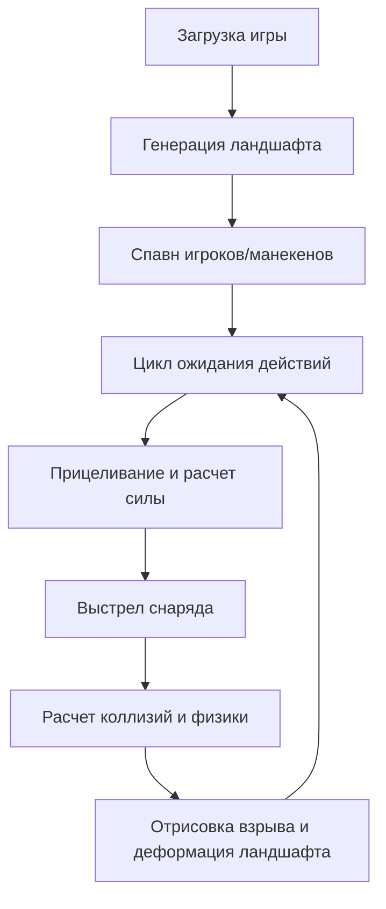

## 1. Обзор продукта
Браузерная 2D-игра, вдохновленная классическими Worms. 
Проект будет разрабатываться в два этапа: первая версия — одиночный режим (стрельба по неубиваемому червяку для отработки физики и графики), вторая версия — добавление сетевой игры через Firebase/Firestore или WebRTC.

## 2. Ключевые функции

### 2.1 Игровые роли
| Роль | Способ входа | Основные права |
|------|--------------|----------------|
| Игрок | Анонимно | Управление червяком, стрельба, перемещение |

### 2.2 Функциональные модули
1. **Главное меню**: Выбор режима игры, настройки.
2. **Игровая арена**: Генерация ландшафта, физика, управление персонажем, стрельба.
3. **Модуль тестирования**: Автоматизированные тесты для проверки каждой функции.

### 2.3 Детали страниц и экранов
| Экран | Название модуля | Описание функции |
|-------|-----------------|------------------|
| Игра | Движок физики | Обработка гравитации, коллизий, траекторий снарядов |
| Игра | Управление | Перемещение червяка (влево, вправо, прыжок), прицеливание и выстрел |
| Игра | Генерация | Процедурная генерация разрушаемого ландшафта |

## 3. Основной процесс

## 4. Дизайн пользовательского интерфейса
### 4.1 Стиль дизайна
- Цвета: Яркие, мультяшные (зеленый ландшафт, голубое небо).
- Кнопки: Округлые 2D элементы с легким эффектом объема.
- Шрифты: Крупные, читаемые пиксельные или комиксные шрифты.
- Анимации: Плавные CSS и Canvas анимации для эффектов взрывов.

### 4.2 Дизайн страниц
| Экран | Название модуля | Элементы UI |
|-------|-----------------|-------------|
| Главный экран | Канвас | Рендер игрового поля, индикатор силы, индикатор ветра, здоровье |

### 4.3 Адаптивность
Desktop-first, управление с клавиатуры и мыши. Поддержка масштабирования canvas под размер окна браузера.
