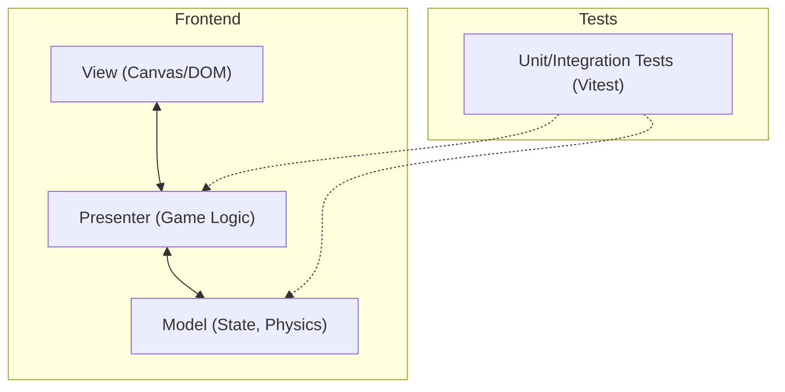

## 1. Архитектурный дизайн
Используется паттерн MVP (Model-View-Presenter). 

## 2. Описание технологий
- Фронтенд: TypeScript + HTML5 Canvas API для рендеринга.
- Сборка: Vite.
- Защита кода: vite-plugin-javascript-obfuscator (для обфускации фронтенд кода при билде).
- Тестирование: Vitest (Unit и Integration тесты).
- Структура: Строгое разделение на Model, View, Presenter. Каждый класс/скрипт в отдельном файле.

## 3. Определение структуры папок
| Путь | Назначение |
|-------|---------|
| `/src/models` | Хранение состояния игры, сущности (Worm, Projectile, Landscape) |
| `/src/views` | Отрисовка на Canvas, обработка инпутов (Renderer, InputHandler) |
| `/src/presenters` | Связующее звено, игровой цикл, физика (GamePresenter, PhysicsEngine) |
| `/src/utils` | Вспомогательные функции (MathUtils, Collision) |
| `/tests` | Автотесты (отдельные файлы для unit и интеграционных тестов) |

## 4. План реализации (Фаза 1)
1. Инициализация проекта (Vite + TypeScript + Vitest).
2. Настройка обфускации кода для production-билда.
3. Разработка базовых утилит и моделей с автотестами.
4. Создание генератора ландшафта (Model).
5. Разработка физики (гравитация, баллистика снарядов).
6. Реализация View (отрисовка червяка, прицела, ландшафта).
7. Сборка Presenter для управления игровым циклом (Game Loop).
8. Интеграционное тестирование всего процесса выстрела.
