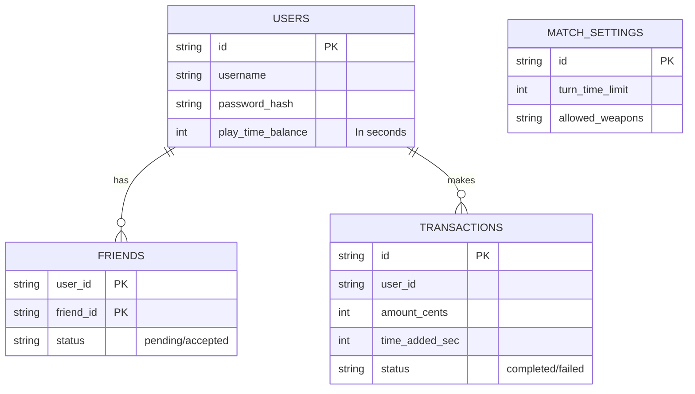

## 1. Архитектурный дизайн (Полный стек Cloudflare)

```mermaid
flowchart TD
    subgraph Frontend (Vite + Canvas)
        UI["UI (Lobby, Auth, Friends)"]
        GL["Game Logic (MVP + Physics)"]
        WR["WebRTC (P2P Match)"]
    end
    subgraph Cloudflare Pages Functions (Backend)
        API["REST API (Auth, Matchmaking, Balance)"]
        WH["Payment Webhook (Stripe/Crypto)"]
    end
    subgraph Cloudflare D1 (Database)
        U[("Users")]
        F[("Friends")]
        M[("Matches & Settings")]
        T[("Transactions")]
    end
    
    UI <--> API
    API <--> U
    API <--> F
    API <--> M
    WH --> T
    T --> U
    GL <--> WR
```

## 2. Описание технологий
- Фронтенд: TypeScript + HTML5 Canvas (Vite). Оптимизация `destination-out` для кратеров.
- Бэкенд: Cloudflare Pages Functions (Serverless).
- База данных: Cloudflare D1 (Edge SQLite).
- Сеть: Trystero (или кастомный WebRTC) для P2P-передачи координат и кратеров.

## 3. Физический движок (Доработки)
Движок (`PhysicsEngine.ts`) требует следующих математических апгрейдов:
1. **Расчет нормалей**: При ходьбе червяк сканирует пиксели ландшафта (через `Math.atan2(dy, dx)`) в радиусе вокруг себя.
2. **Ограничение угла (Slope Limit)**: Если угол склона превышает 60°, обнуляем `vx` от кнопок ходьбы и применяем гравитацию (червяк скатывается).
3. **Состояние "в воздухе"**: Ввод с кнопок (стрелки влево/вправо) умножается на коэффициент `airControl = 0.5` вместо жесткого стопа.
4. **Защита от проваливания**: При проверке коллизий движок должен толкать червяка не только вверх, но и по вектору нормали, чтобы избежать бага "исчезновения", если червяк застрял в 5-пиксельной неразрушаемой стене.

## 4. Схема Базы Данных (Cloudflare D1)

### 4.1 Data Model Definition


### 4.2 Data Definition Language (DDL)
```sql
CREATE TABLE Users (
  id TEXT PRIMARY KEY,
  username TEXT UNIQUE,
  password_hash TEXT,
  play_time_balance INTEGER DEFAULT 0,
  created_at DATETIME DEFAULT CURRENT_TIMESTAMP
);

CREATE TABLE Friends (
  user_id TEXT,
  friend_id TEXT,
  status TEXT,
  PRIMARY KEY (user_id, friend_id)
);

CREATE TABLE Transactions (
  id TEXT PRIMARY KEY,
  user_id TEXT,
  amount_cents INTEGER,
  time_added_sec INTEGER,
  status TEXT,
  created_at DATETIME DEFAULT CURRENT_TIMESTAMP
);
```